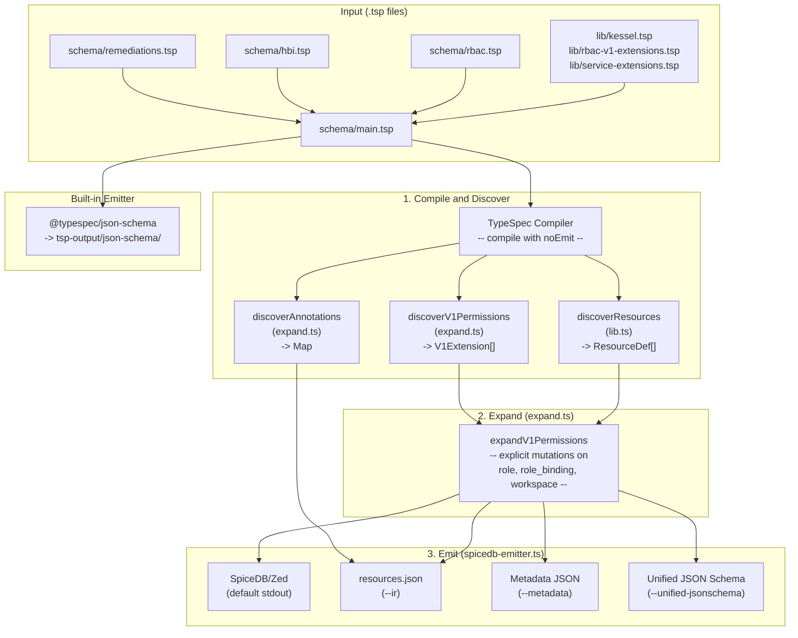

# TypeSpec-as-Schema POC

Prototype exploring [TypeSpec](https://typespec.io/) as a unified schema representation for Kessel (same RBAC + HBI benchmark as sibling POCs).

**Layout:**

| Folder | Role |
|--------|------|
| **`schema/`** | **Adopter + composition:** `main.tsp` entrypoint and service modules (`rbac.tsp`, `hbi.tsp`, `remediations.tsp`). No platform vocabulary here. |
| **`lib/`** | **Platform vocabulary:** `kessel.tsp` (Assignable, Permission, ...), `rbac-v1-extensions.tsp` (V1WorkspacePermission params), `service-extensions.tsp` (ResourceAnnotation params). |
| **`src/`** | **Interpreter / tooling:** TypeScript that walks the TypeSpec program and emits SpiceDB, IR, metadata, unified JSON Schema. |
| **`samples/`** | Frozen **`demo-output.txt`** from `make samples` or `make demo` (review without running Node). |
| **`go-consumer/`** | Optional Go binary that embeds emitted IR (`//go:embed`). |
| **`test/`** | Vitest (imports from `src/`). |
| **`docs/`** | Design documents, review analysis, simplification changelog. |

**One-line map:** Authors extend **`schema/`** (and import **`lib/`** for Kessel types); all codegen lives in **`src/`**. Evaluators run **`make demo`** or **`make run`** for a console tour; **`make samples`** refreshes checked-in sample output.

## Quick Start

```bash
npm install
make demo              # or: make run -- SpiceDB + metadata + JSON Schema fragment on stdout
make samples           # regenerate samples/demo-output.txt (same content as demo + file header)
# or stepwise:
npx tsp compile schema/main.tsp
npx tsx src/spicedb-emitter.ts schema/main.tsp
```

## End-to-End Flow

```
 .tsp files                    src/                          Outputs
┌─────────────┐       ┌──────────────────┐
│ lib/        │       │                  │
│  kessel.tsp │       │  TypeSpec        │
│  rbac-v1-.. │──┐    │  Compiler        │
│  service-.. │  │    │  (compile)       │       ┌──────────────────┐
├─────────────┤  │    └────────┬─────────┘       │ SpiceDB .zed     │
│ schema/     │  │             │                 │ (default)        │
│  main.tsp   │──┤        Program                ├──────────────────┤
│  rbac.tsp   │  │        (type graph)           │ Metadata JSON    │
│  hbi.tsp    │  │             │                 │ (--metadata)     │
│  remed..tsp │──┘    ┌────────┴─────────┐       ├──────────────────┤
│             │       │                  │       │ Unified JSON     │
└─────────────┘       │  Discover        │       │ Schema           │
                      │  ├ resources     │       │ (--unified-      │
                      │  │  (lib.ts)     │       │  jsonschema)     │
                      │  ├ v1 perms      │       ├──────────────────┤
                      │  │  (expand.ts)  │       │ IR JSON          │
                      │  └ annotations   │       │ (--ir)           │
                      │     (expand.ts)  │       └────────▲─────────┘
                      └────────┬─────────┘                │
                               │                          │
                      ┌────────┴─────────┐       ┌────────┴─────────┐
                      │                  │       │                  │
                      │  Expand          │       │  Generate        │
                      │  (expand.ts)     │──────▶│  (lib.ts)        │
                      │                  │       │                  │
                      │  For each V1ext: │       │ generateSpiceDB  │
                      │  ┌─────────────┐ │       │ generateMetadata │
                      │  │Role: 4 bool │ │       │ generateUnified  │
                      │  │  + 1 perm   │ │       │   JsonSchemas    │
                      │  │RB: 1 perm   │ │       │ generateIR       │
                      │  │WS: 1 perm   │ │       └──────────────────┘
                      │  │+ view_meta  │ │
                      │  └─────────────┘ │
                      └──────────────────┘
```

## Architecture



### Pipeline

Services register permissions by declaring aliases of **`Kessel.V1WorkspacePermission<App, Res, Verb, V2>`** in their `schema/*.tsp` file. Each alias carries four parameters (application, resource, verb, v2 permission name). Non-RBAC metadata is declared via **`Kessel.ResourceAnnotation<App, Res, Key, Value>`** from `lib/service-extensions.tsp`.

The emitter pipeline has three stages:

1. **Compile and Discover** -- The TypeSpec compiler parses `schema/main.tsp` into a typed program graph. `discoverResources` (in `src/lib.ts`) walks the graph to extract base resource models as `ResourceDef[]`. `discoverV1Permissions` and `discoverAnnotations` (in `src/expand.ts`) find all extension template instances.

2. **Expand** (`src/expand.ts`) -- `expandV1Permissions` takes base resources and V1 extensions. For each extension, it makes 7 explicit mutations:
   - **Role:** 4 bool relations for the permission hierarchy (`{app}_any_any`, `{app}_{res}_any`, `{app}_any_{verb}`, `{app}_{res}_{verb}`)
   - **Role:** 1 computed permission as a union of the hierarchy levels plus `any_any_any`
   - **RoleBinding:** 1 intersection permission (`subject & t_granted->{v2}`)
   - **Workspace:** 1 union permission (`t_binding->{v2} + t_parent->{v2}`)
   - After all extensions, a `view_metadata` permission is added to workspace as a union of all read-verb permissions.

3. **Emit** (`src/spicedb-emitter.ts`) -- produces SpiceDB/Zed text (default), IR JSON (`--ir`), per-service metadata (`--metadata`), or unified JSON Schema (`--unified-jsonschema`).

### Source Files

```
src/
  lib.ts              # Types (ResourceDef, RelationDef, RelationBody, V1Extension),
                      # resource discovery, SpiceDB/JSON/metadata/IR generators
  expand.ts           # V1 permission discovery, annotation discovery,
                      # explicit permission expansion
  spicedb-emitter.ts  # CLI entry point: compile -> discover -> expand -> emit
```

### Permission Expressions

The emitter's `parsePermissionExpr` maps `Permission<"...">` **string** bodies to an internal `RelationBody` tree. Only this **subset** is supported (enough for the benchmark):

- **Single reference:** `binding`, `subject`, `any_any_any`, ... -> `ref`
- **Subreference:** `binding->granted` or dot form `a.b` -> `subref` with `t_`-prefixed relation name
- **Union:** operands joined by **` | `** or **` + `** -> `or` (each operand may use `name->sub`)
- **Intersection:** operands joined by **` & `** -> `and` (same `->` rule)

### How to Validate End-to-End

From `poc/typespec-as-schema/`:

1. **Install deps (once)**

   ```bash
   npm install
   ```

2. **Full compile**

   ```bash
   make compile
   ```

   Confirms `schema/main.tsp` + imports type-check and the built-in JSON Schema emit runs.

3. **Automated tests**

   ```bash
   npx vitest run
   ```

   Runs 102 tests covering: V1 permission discovery, expansion semantics, SpiceDB output correctness (vs golden reference), unified JSON Schema scoping, annotation collection, metadata output, and structural conventions.

4. **Console tour (optional)**

   ```bash
   make demo
   ```

   or `make run` -- SpiceDB snippet + metadata + unified JSON Schema fragment on stdout.

5. **IR + Go path (no Node at runtime)**

   ```bash
   make emit-ir    # or: make all  # compile + IR + go-build
   make go-build   # if you only ran emit-ir
   ./go-consumer/bin/schema-consumer
   ```

   Confirms embedded IR loads and the Go binary prints resources/extensions.

6. **Optional: refresh checked-in samples**

   ```bash
   make samples
   ```

   Regenerates `samples/demo-output.txt` for reviewers; diff if you care about golden output.

## File Structure

```
lib/
  kessel.tsp                # Platform types: Assignable, BoolRelation, Permission, Cardinality
  rbac-v1-extensions.tsp    # V1WorkspacePermission<App, Res, Verb, V2> template
  service-extensions.tsp    # ResourceAnnotation<App, Res, Key, Value> template
schema/
  main.tsp                  # Entrypoint -- imports all service modules
  rbac.tsp                  # RBAC core: Principal, Role, RoleBinding, Workspace
  hbi.tsp                   # HBI: Host resource with workspace relation + permissions
  remediations.tsp          # Remediations: permissions-only (no resource definition)
src/
  lib.ts                    # Types, resource discovery, all output generators
  expand.ts                 # Extension discovery + explicit V1 permission expansion
  spicedb-emitter.ts        # CLI entry point
docs/
  Simplification-Changelog.md       # Before/after architecture, data flow
  TypeSpec-v2-Review-and-Simplification.md  # V2 review + simplification proposals
  Karpathy-Cross-POC-Complexity-Review.md   # Cross-POC complexity analysis
  TypeSpec-POC-Design-Document.md    # Original design document
samples/
  demo-output.txt
go-consumer/
test/
  unit/                     # Pure unit tests (no TypeSpec compilation)
  integration/              # Full pipeline tests (compile + discover + expand + emit)
tspconfig.yaml
Makefile
```

## Benchmark Highlights

| Feature | TypeSpec |
|---------|----------|
| Resource + relation modeling | Y |
| Zanzibar-style `Permission<"expr">` | Y |
| Data fields + JSON Schema | Y |
| Cooperative extensions | Y (explicit expansion in `expand.ts`) |
| SpiceDB / Zed output | Y |
| Metadata per service | Y |
| IR for Go consumer | Y |
| Annotations (non-RBAC metadata) | Y |

## Risks and Tradeoffs

- **Node.js in CI** for `tsp` + `tsx`; Go consumer runtime needs no Node.
- **Emitter maintenance** -- new extension types require adding logic to `src/expand.ts`.
- **Single expansion function** -- `expandV1Permissions` is explicit and readable, but adding a second extension template means writing a second expansion function (a deliberate tradeoff: explicit code over a generic framework).

## Refresh `samples/demo-output.txt`

```bash
make samples
# equivalent:
make demo > samples/demo-output.txt 2>&1
```
