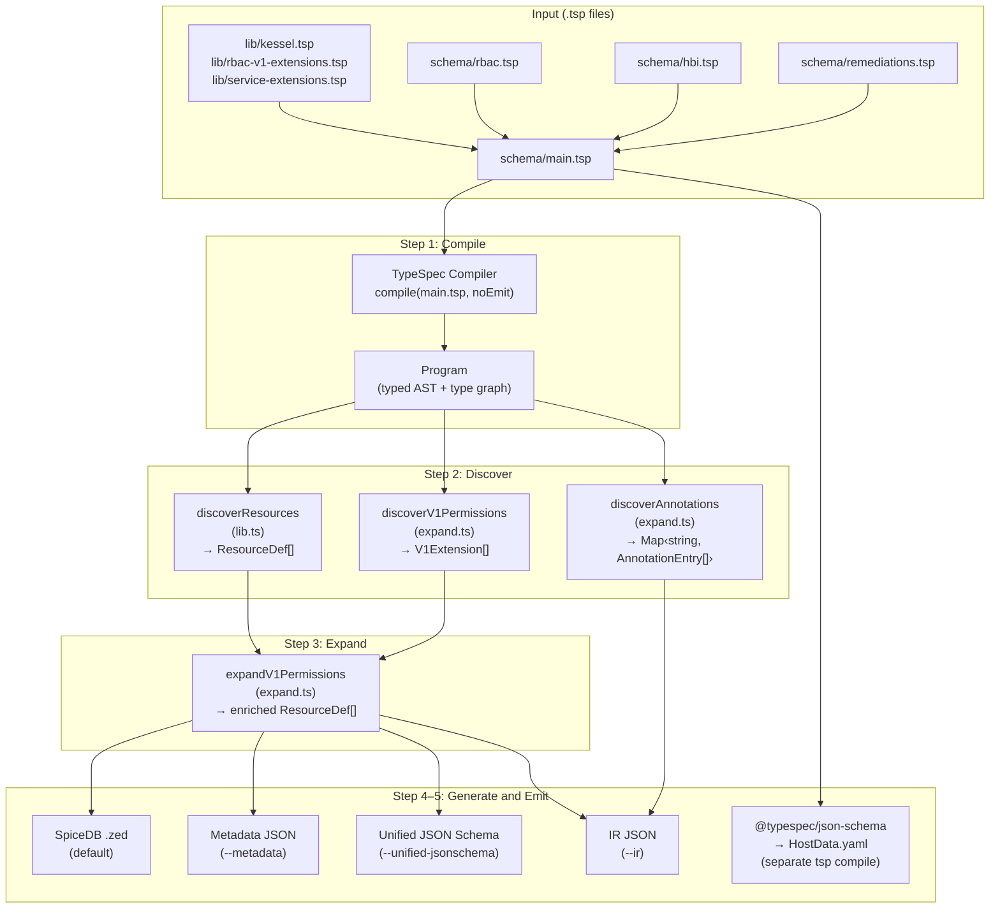
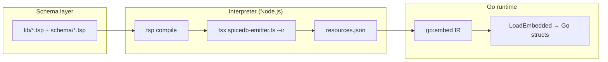

# TypeSpec-as-Schema: Design Document

**Audience:** RBAC platform, service schema authors, and evaluators comparing schema representation finalists.
**Scope:** `poc/typespec-as-schema` as implemented in this repository; not a committed product roadmap.
**Date:** April 2026

---

## Table of Contents

1. [Context and Goals](#1-context-and-goals)
2. [What Service Developers Write](#2-what-service-developers-write)
3. [End-to-End Flow](#3-end-to-end-flow)
4. [Extension Design](#4-extension-design)
5. [Outputs](#5-outputs)
6. [Concrete Example: Tracing inventory_host_view](#6-concrete-example-tracing-inventory_host_view)
7. [Go Consumption and the IR](#7-go-consumption-and-the-ir)
8. [Architecture, Ownership, and Tensions](#8-architecture-ownership-and-tensions)
9. [Adding a New Service](#9-adding-a-new-service)
10. [Source File Map and Commands](#10-source-file-map-and-commands)

---

## 1. Context and Goals

Kessel currently uses multiple, service-aligned representations for service provider schema. These representations describe overlapping aspects of a service's management fabric requirements and must agree with each other. KSL-055 proposes that if service developers could express their schema requirements in a **single representation**, it would simplify onboarding.

This POC explores **TypeSpec** as that single representation. The POC validates this against a benchmark covering:

1. A simplified RBAC + HBI access schema with relationships and extensions
2. Input validation rules (relationship properties, cardinality)
3. Arbitrary metadata (v1 permission, application, resource, verb)
4. An advanced extension with conditional logic and accumulation

---

## 2. What Service Developers Write

Everything starts with **three layers of `.tsp` files** and a single entrypoint.

### Platform vocabulary (`lib/`) -- shared, owned by RBAC platform

| File | Purpose |
|------|---------|
| `lib/kessel.tsp` | Core marker models: `Assignable<Target, Card>`, `Permission<Expr>`, `BoolRelation<Target>`, `Cardinality` enum. Typed slots that the emitter recognizes and converts to SpiceDB relations/permissions. |
| `lib/rbac-v1-extensions.tsp` | `V1WorkspacePermission<App, Res, Verb, V2>` -- 4-param template. Services instantiate this to register permissions. The expansion logic lives in `src/expand.ts`. |
| `lib/service-extensions.tsp` | `ResourceAnnotation<App, Resource, Key, Value>` -- 4-param template for attaching non-RBAC metadata (feature flags, retention policies) to resources. |

### Service schemas (`schema/`) -- service teams own their files

| File | Owner | What it declares |
|------|-------|-----------------|
| `schema/rbac.tsp` | RBAC | `Principal`, `Role`, `RoleBinding`, `Workspace` with Kessel relation types. Base resource structure only -- no per-service permissions here. |
| `schema/hbi.tsp` | HBI / Inventory | `Host` model (relations + data), `HostData` model (`@jsonSchema` for built-in JSON Schema emit), two `V1WorkspacePermission` aliases, two `ResourceAnnotation` aliases (feature flag + retention). |
| `schema/remediations.tsp` | Remediations | Permissions-only service: two `V1WorkspacePermission` aliases, no resource models. |

### Entrypoint

`schema/main.tsp` imports the platform library and all service schemas:

```typespec
import "../lib/rbac-v1-extensions.tsp";
import "../lib/service-extensions.tsp";
import "./rbac.tsp";
import "./hbi.tsp";
import "./remediations.tsp";
```

Adding a new service means adding one import line here and creating a new `schema/<service>.tsp` file.

### How RBAC uses the system

In `schema/rbac.tsp`, the RBAC team defines the **base resource graph**:

```typespec
namespace RBAC;

model Role {
  any_any_any: BoolRelation<Principal>;
}

model RoleBinding {
  subject: Assignable<Principal, Cardinality.Any>;
  granted: Assignable<Role, Cardinality.AtLeastOne>;
}

model Workspace {
  parent: Assignable<Workspace, Cardinality.AtMostOne>;
  binding: Assignable<RoleBinding, Cardinality.Any>;
}
```

RBAC does **not** list every service's permissions here. The `V1WorkspacePermission` template plus the expansion function in `src/expand.ts` handle that automatically.

### How services use the system

A service team creates a `schema/*.tsp` file and does three things:

**a) Register permissions via the template:**

```typespec
alias viewPermission = Kessel.V1WorkspacePermission<
  "inventory",   // application
  "hosts",       // resource
  "read",        // verb
  "inventory_host_view"  // v2 permission name
>;
```

This single alias triggers the full permission hierarchy across role, role_binding, and workspace. No emitter code changes required.

**b) Define the resource model:**

```typespec
model Host {
  workspace: Assignable<RBAC.Workspace, Cardinality.ExactlyOne>;
  data: HostData;
  view: Permission<"workspace.inventory_host_view">;
  update: Permission<"workspace.inventory_host_update">;
}
```

**c) Define data fields (for JSON Schema):**

```typespec
@jsonSchema
model HostData {
  @format("uuid") subscription_manager_id?: string;
  satellite_id?: string | SatelliteNumericId;
  @format("uuid") insights_id?: string;
  @maxLength(255) ansible_host?: string;
}
```

---

## 3. End-to-End Flow

The entire pipeline is **5 steps**, implemented in **3 source files** (738 lines total).

```
 .tsp files                  src/                              Outputs
┌──────────────┐
│ lib/         │
│  kessel.tsp  │      Step 1: COMPILE
│  rbac-v1-..  │──┐   ┌─────────────────────┐
│  service-..  │  │   │ TypeSpec Compiler    │
├──────────────┤  ├──▶│ compile(main.tsp)    │
│ schema/      │  │   │ → Program            │
│  main.tsp    │──┤   │   (full type graph)  │
│  rbac.tsp    │  │   └──────────┬──────────┘
│  hbi.tsp     │  │              │
│  remed..tsp  │──┘              │
└──────────────┘     ┌───────────┼───────────┐
                     │           │           │
                     ▼           ▼           ▼
               Step 2       Step 2       Step 2
              DISCOVER     DISCOVER     DISCOVER
              resources    V1 perms    annotations
              (lib.ts)    (expand.ts)  (expand.ts)
                     │           │           │
                     ▼           ▼           │
              ResourceDef[] V1Extension[]    │
              [principal,   [inv_host_view,  │
               role,         inv_host_upd,   │
               role_binding, rem_rem_view,   │
               workspace,    rem_rem_upd]    │
               host]              │          │
                     │            │          │
                     └─────┬──────┘          │
                           ▼                 │
                     Step 3: EXPAND          │
                     (expand.ts)             │
                           │                 │
                     For each V1Extension:   │
                     ┌─────────────────┐     │
                     │ Role:           │     │
                     │  4 bool rels    │     │
                     │  1 union perm   │     │
                     │ RoleBinding:    │     │
                     │  1 intersect    │     │
                     │ Workspace:      │     │
                     │  1 union perm   │     │
                     └─────────────────┘     │
                     + view_metadata         │
                       (all read-verb        │
                        perms OR'd)          │
                           │                 │
                           ▼                 │
                     Enriched                │
                     ResourceDef[]           │
                           │                 │
              ┌────────────┼────────┐        │
              ▼            ▼        ▼        ▼
         Step 4:      Step 4:   Step 4:  Step 4:
        GENERATE     GENERATE  GENERATE GENERATE
         SpiceDB     Metadata   Unified    IR
         (lib.ts)    (lib.ts)  JSON Sch  (lib.ts)
              │            │    (lib.ts)     │
              ▼            ▼        │        ▼
                                    ▼
         Step 5: EMIT (spicedb-emitter.ts)
              │            │        │        │
              ▼            ▼        ▼        ▼
         stdout        stdout   stdout   file
         .zed          .json    .json    .json
```

### Step 1: Compile

`spicedb-emitter.ts` calls `@typespec/compiler`'s `compile()` with `noEmit: true`. This loads `schema/main.tsp` and all imports into a typed `Program` object -- a full AST with a resolved type graph. Models, properties, template instantiations, and namespaces are all first-class objects you can walk.

### Step 2: Discover (three parallel walks)

Three discovery functions walk the same `Program`:

**a) `discoverResources(program)`** in `lib.ts` -- walks all models via `navigateProgram()`. For each model, it skips bare templates, Kessel-namespace markers, extension template instances, and `Data`-suffixed models. For everything else, it inspects properties:

- `Assignable<T, C>` → relation with target and cardinality
- `BoolRelation<T>` → boolean wildcard relation
- `Permission<Expr>` → computed permission, body parsed by `parsePermissionExpr`

Produces `ResourceDef[]`: `principal`, `role`, `role_binding`, `workspace`, `host`.

**b) `discoverV1Permissions(program)`** in `expand.ts` -- finds all instantiations of the `V1WorkspacePermission` template using two strategies:

1. `navigateProgram` walk -- finds instances the compiler materialized
2. Source file alias scan -- iterates `program.sourceFiles`, resolves each alias, checks if it's a `V1WorkspacePermission` instance

Extracts params (`application`, `resource`, `verb`, `v2Perm`) from each. Deduplicates. Returns `V1Extension[]`.

**c) `discoverAnnotations(program)`** in `expand.ts` -- same walk pattern, looking for `ResourceAnnotation` instances. Groups results by `application/resource` key. Returns `Map<string, AnnotationEntry[]>`.

### Step 3: Expand

`expandV1Permissions(resources, extensions)` in `expand.ts` takes the base resources and V1 extensions. For each extension, it makes **7 explicit mutations** on the RBAC resources:

| # | Target | What | Example for `inventory_host_view` |
|---|--------|------|-----------------------------------|
| 1 | Role | Bool relation `{app}_any_any` | `inventory_any_any: rbac/principal:*` |
| 2 | Role | Bool relation `{app}_{res}_any` | `inventory_hosts_any: rbac/principal:*` |
| 3 | Role | Bool relation `{app}_any_{verb}` | `inventory_any_read: rbac/principal:*` |
| 4 | Role | Bool relation `{app}_{res}_{verb}` | `inventory_hosts_read: rbac/principal:*` |
| 5 | Role | Permission = union of hierarchy | `inventory_host_view = any_any_any + inventory_any_any + ...` |
| 6 | RoleBinding | Permission = intersection | `inventory_host_view = (subject & t_granted->inventory_host_view)` |
| 7 | Workspace | Permission = delegation | `inventory_host_view = t_binding->... + t_parent->...` |

After all extensions, if any had `verb === "read"`, a **`view_metadata`** permission is added to Workspace as a union of all read-verb permissions:

```
view_metadata = inventory_host_view + remediations_remediation_view
```

Bool relation deduplication uses a `Set<string>` -- when two extensions share the same application (e.g., `inventory_host_view` and `inventory_host_update`), `inventory_any_any` is added only once.

Returns the enriched `ResourceDef[]`.

### Step 4: Generate

The enriched `ResourceDef[]` is passed to one of four generator functions, all in `lib.ts`:

| Generator | Input | Output |
|-----------|-------|--------|
| `generateSpiceDB(fullSchema)` | `ResourceDef[]` | SpiceDB/Zed text with `definition` blocks, `relation`/`permission` lines |
| `generateMetadata(resources, extensions)` | `ResourceDef[]` + `V1Extension[]` | Per-application permission and resource lists |
| `generateUnifiedJsonSchemas(fullSchema)` | `ResourceDef[]` | JSON Schema with `_id` fields for `ExactlyOne` assignable relations |
| `generateIR(mainFile, fullSchema, extensions, annotations)` | Everything | All-in-one JSON with resources, extensions, spicedb, metadata, jsonSchemas, annotations |

### Step 5: Emit

`spicedb-emitter.ts` selects the output format based on CLI flags:

| Flag | Generator | Output destination |
|------|-----------|-------------------|
| *(default)* | `generateSpiceDB` | stdout |
| `--metadata` | `generateMetadata` | stdout |
| `--unified-jsonschema` | `generateUnifiedJsonSchemas` | stdout |
| `--ir [path]` | `generateIR` | file (default: `go-consumer/resources.json`) |

The built-in `@typespec/json-schema` emitter runs separately via `tsp compile schema/main.tsp` and produces `tsp-output/json-schema/HostData.yaml`.

### Mermaid diagram



---

## 4. Extension Design

### How extensions work

Extension templates are plain TypeSpec models with type parameters. They carry **no logic** -- they are data declarations:

```typespec
// lib/rbac-v1-extensions.tsp
model V1WorkspacePermission<
  App extends string,
  Res extends string,
  Verb extends string,
  V2 extends string
> {
  application: App;
  resource: Res;
  verb: Verb;
  v2Perm: V2;
}
```

Services instantiate the template:

```typespec
// schema/hbi.tsp
alias viewPermission = Kessel.V1WorkspacePermission<
  "inventory", "hosts", "read", "inventory_host_view"
>;
```

The TypeSpec compiler materializes this into a concrete model with property values `application="inventory"`, `resource="hosts"`, etc. The discovery function in `expand.ts` walks the program graph, finds these instances, and extracts the parameter values.

The expansion logic -- what mutations to make on Role, RoleBinding, and Workspace -- is **explicit TypeScript code** in `expandV1Permissions()`. There is no string parsing, no rule interpolation, no generic patch framework. The 7 mutations per extension are written as straightforward function calls.

### ResourceAnnotation (non-RBAC extension)

```typespec
// lib/service-extensions.tsp
model ResourceAnnotation<
  Application extends string,
  Resource extends string,
  Key extends string,
  Value extends string
> {
  application: Application;
  resource: Resource;
  key: Key;
  value: Value;
}
```

Used by services to attach metadata that appears in the IR but does **not** affect the SpiceDB schema:

```typespec
// schema/hbi.tsp
alias featureFlag = Kessel.ResourceAnnotation<
  "inventory", "host", "feature_flag", "staleness_v2"
>;
```

### Permission expression subset

`parsePermissionExpr` in `lib.ts` maps `Permission<"...">` bodies to an internal `RelationBody` tree. Only this subset is supported (enough for the benchmark):

- **Single reference:** `binding`, `subject`, `any_any_any` → `ref`
- **Subreference:** `workspace.inventory_host_view` or `binding->granted` → `subref`
- **Union:** operands joined by ` | ` or ` + ` → `or`
- **Intersection:** operands joined by ` & ` → `and`

Mixed `&` and `|` without grouping is not modeled.

### Design tradeoffs

**Strengths:**

- Service teams never edit `src/` to add a standard permission -- they add one alias in their `schema/` file
- The expansion logic is explicit and readable -- each mutation is a visible function call
- One expanded graph feeds all emitters (SpiceDB, IR, metadata, unified JSON Schema)
- No string parsing or interpolation at runtime for extension rules

**Weaknesses:**

- Adding a new extension template with different expansion logic requires changes in `src/expand.ts`
- `ResourceDef` is shaped for authorization projection, not a fully neutral domain model
- TypeSpec does not validate permission expression strings at compile time

---

## 5. Outputs

### SpiceDB/Zed schema (stdout, default)

```
definition rbac/principal {}

definition rbac/role {
    permission any_any_any = t_any_any_any
    permission inventory_host_view = any_any_any + inventory_any_any + ...
    relation t_any_any_any: rbac/principal:*
    ...
}

definition rbac/role_binding {
    permission inventory_host_view = (subject & t_granted->inventory_host_view)
    ...
}

definition rbac/workspace {
    permission view_metadata = inventory_host_view + remediations_remediation_view
    permission inventory_host_view = t_binding->inventory_host_view + t_parent->inventory_host_view
    ...
}

definition inventory/host {
    permission view = t_workspace->inventory_host_view
    permission update = t_workspace->inventory_host_update
    relation t_workspace: rbac/workspace
}
```

### JSON Schema (`tsp compile`)

`tsp-output/json-schema/HostData.yaml`:

```yaml
$schema: https://json-schema.org/draft/2020-12/schema
type: object
properties:
  subscription_manager_id:
    type: string
    format: uuid
  satellite_id:
    anyOf:
      - type: string
      - $ref: "#/$defs/SatelliteNumericId"
  insights_id:
    type: string
    format: uuid
  ansible_host:
    type: string
    maxLength: 255
```

### Intermediate Representation (`--ir`)

`go-consumer/resources.json` (truncated):

```json
{
  "version": "1.2.0",
  "resources": [ /* full expanded ResourceDef[] */ ],
  "extensions": [
    { "application": "inventory", "resource": "hosts", "verb": "read", "v2Perm": "inventory_host_view" }
  ],
  "spicedb": "definition rbac/principal { ... }",
  "metadata": {
    "inventory": { "permissions": ["inventory_host_view", "inventory_host_update"], "resources": ["host"] },
    "remediations": { "permissions": ["remediations_remediation_view", "remediations_remediation_update"], "resources": [] }
  },
  "jsonSchemas": {
    "inventory/host": {
      "properties": {
        "workspace_id": { "type": "string", "format": "uuid" }
      },
      "required": ["workspace_id"]
    }
  },
  "annotations": {
    "inventory/host": {
      "feature_flag": "staleness_v2",
      "retention_days": "90"
    }
  }
}
```

---

## 6. Concrete Example: Tracing inventory_host_view

Starting point -- `schema/hbi.tsp`:

```typespec
alias viewPermission = Kessel.V1WorkspacePermission<"inventory", "hosts", "read", "inventory_host_view">;
```

**Step 2 (Discover):** `discoverV1Permissions` walks the program, finds this alias, extracts:

```
{ application: "inventory", resource: "hosts", verb: "read", v2Perm: "inventory_host_view" }
```

**Step 3 (Expand):** `expandV1Permissions` processes this extension:

| # | Target | Mutation | Result |
|---|--------|----------|--------|
| 1 | Role | Bool relation | `inventory_any_any: rbac/principal:*` |
| 2 | Role | Bool relation | `inventory_hosts_any: rbac/principal:*` |
| 3 | Role | Bool relation | `inventory_any_read: rbac/principal:*` |
| 4 | Role | Bool relation | `inventory_hosts_read: rbac/principal:*` |
| 5 | Role | Union permission | `inventory_host_view = any_any_any + inventory_any_any + inventory_hosts_any + inventory_any_read + inventory_hosts_read` |
| 6 | RoleBinding | Intersection permission | `inventory_host_view = (subject & t_granted->inventory_host_view)` |
| 7 | Workspace | Union permission | `inventory_host_view = t_binding->inventory_host_view + t_parent->inventory_host_view` |

Because `verb === "read"`, `inventory_host_view` is collected for `view_metadata`.

After all extensions are processed, the accumulated `view_metadata` is emitted:

```
view_metadata = inventory_host_view + remediations_remediation_view
```

(Both `inventory_host_view` and `remediations_remediation_view` had `verb=read`.)

---

## 7. Go Consumption and the IR

### Path to a Go in-memory struct

The path is **build-time Node → JSON IR → Go load**, not "parse `.tsp` in Go at runtime":



The **in-memory model available to Go** is the IR, not the live TypeSpec compiler graph. Anything a Go service needs at runtime must either be in the IR or re-derived from IR fields.

### IR fields

| Field | Content |
|-------|---------|
| `resources` | Expanded `ResourceDef[]` after V1 permission expansion |
| `extensions` | Slim `V1Extension[]` (application, resource, verb, v2Perm) for metadata/UX |
| `spicedb` | Pre-rendered Zed string |
| `metadata` | Per-application permission and resource lists |
| `jsonSchemas` | Unified JSON Schema fragments for non-`rbac` resources |
| `annotations` | Key-value metadata from `ResourceAnnotation` extensions, keyed by resource |

### Limitations

- **No native TypeSpec in Go** -- runtime is IR only, unless you shell out to Node
- **Build-time Node dependency** -- generating IR requires `npm` + `tsp` + `tsx`
- **IR version coupling** -- the `version` field must stay compatible when the IR shape changes
- **Two JSON Schema paths** -- built-in emitter writes `tsp-output/` from `@jsonSchema` models; the unified JSON Schema is a separate path. Consumers must know which is authoritative for their use case

---

## 8. Architecture, Ownership, and Tensions

### Three-layer ownership

| Layer | Location | Owner | Edits for new service? |
|-------|----------|-------|----------------------|
| Platform vocabulary | `lib/kessel.tsp` | Platform / RBAC | No |
| Extension templates | `lib/rbac-v1-extensions.tsp`, `lib/service-extensions.tsp` | Platform / RBAC | Only to add new templates |
| Service schemas | `schema/` | Service teams | Yes -- new `.tsp` file + import |
| Interpreter / emitter | `src/` | Platform tooling | No (for standard patterns) |

### The central tension: schema vs interpreter

Extension templates declare **what parameters** a service provides. The expansion function in `src/expand.ts` defines **what to do** with those parameters. This split is intentional:

**Where it works well:** Service teams never edit `src/` to add a standard permission or annotation. They add an alias in their `schema/` file.

**Where the tension shows:** Adding a new extension template with different expansion semantics requires writing a new expansion function in `src/expand.ts`.

### Extension flexibility matrix

| Change type | What to edit | `src/` changes? |
|------------|-------------|-----------------|
| New instance of existing template (e.g., new V1 permission) | `schema/*.tsp` only | No |
| New annotation on a resource | `schema/*.tsp` only | No |
| New extension template with new expansion logic | `lib/*.tsp` + `src/expand.ts` | Yes |
| New output format from existing data | `src/` emitter only | Yes |

### Extension decoupling from output formatting

After expansion, the enriched `ResourceDef[]` is a single in-memory graph. All four generators project this same graph into different output formats. Adding a new output format means adding a new generator function in `lib.ts` -- no changes to the expansion logic.

### Writable relationships and JSON Schema

The unified JSON Schema only includes `_id` fields for assignable relations with `ExactlyOne` cardinality (e.g., `workspace_id` on `inventory/host`). Computed permissions and non-assignable relations do not generate JSON Schema fields.

`generateUnifiedJsonSchemas` **skips** `namespace === "rbac"` -- it focuses on service resources (e.g. `inventory/host`).

---

## 9. Adding a New Service

To add a **Notifications** service with a `notification` resource and a `read` permission:

### 1. Create `schema/notifications.tsp`

```typespec
import "../lib/kessel.tsp";
import "../lib/rbac-v1-extensions.tsp";
import "./rbac.tsp";

using Kessel;

namespace Notifications;

alias viewPermission = Kessel.V1WorkspacePermission<
  "notifications",
  "notifications",
  "read",
  "notifications_notification_view"
>;

model Notification {
  workspace: Assignable<RBAC.Workspace, Cardinality.ExactlyOne>;
  view: Permission<"workspace.notifications_notification_view">;
}
```

### 2. Add one import to `schema/main.tsp`

```typespec
import "./notifications.tsp";
```

### 3. Run

```bash
npx tsx src/spicedb-emitter.ts schema/main.tsp
```

The emitter automatically:
- Discovers the `V1WorkspacePermission` instance and extracts params
- Adds `notifications_*` bool relations and permissions to `rbac/role`
- Adds intersection permission to `rbac/role_binding`
- Adds delegation permission to `rbac/workspace`
- Adds `notifications_notification_view` to `view_metadata` (because `verb=read`)
- Emits `definition notifications/notification { ... }`

**No TypeScript code changes required.**

---

## 10. Source File Map and Commands

```
poc/typespec-as-schema/
├── lib/                         Platform vocabulary + extension templates
│   ├── kessel.tsp                 Assignable, Permission, BoolRelation, Cardinality
│   ├── rbac-v1-extensions.tsp     V1WorkspacePermission<App, Res, Verb, V2> params
│   └── service-extensions.tsp     ResourceAnnotation<App, Res, Key, Value> params
│
├── schema/                      Service schemas (service teams own their files)
│   ├── main.tsp                   Entrypoint — imports all service schemas
│   ├── rbac.tsp                   Principal, Role, RoleBinding, Workspace
│   ├── hbi.tsp                    Host + HostData + V1 permission aliases + annotations
│   └── remediations.tsp           Permissions-only service
│
├── src/                         Interpreter / emitter (platform tooling, 3 files)
│   ├── lib.ts                     Types, resource discovery, permission parser, generators
│   ├── expand.ts                  V1 permission + annotation discovery, explicit expansion
│   └── spicedb-emitter.ts         CLI entry point: compile → discover → expand → emit
│
├── docs/                        Design and analysis documents
│   ├── TypeSpec-POC-Design-Document.md   This document
│   ├── Simplification-Changelog.md       Before/after architecture comparison
│   ├── TypeSpec-v2-Review-and-Simplification.md  V2 review + simplification proposals
│   └── Karpathy-Cross-POC-Complexity-Review.md   Cross-POC complexity analysis
│
├── go-consumer/                 Go binary consuming emitted IR
│   └── resources.json             Embedded IR (//go:embed)
│
├── test/                        Vitest test suite (102 tests)
│   ├── unit/                      Pure unit tests (no TypeSpec compilation)
│   └── integration/               Full pipeline tests (compile + discover + expand + emit)
│
├── tsp-output/                  Built-in emitter output
│   └── json-schema/HostData.yaml  JSON Schema from @jsonSchema models
│
├── samples/                     Frozen demo output for reviewers
├── package.json
├── tspconfig.yaml
└── Makefile
```

### Key commands

| Command | What it does |
|---------|-------------|
| `npm install` | Install dependencies (once) |
| `tsp compile schema/main.tsp` | Type-check + built-in JSON Schema emit |
| `npx tsx src/spicedb-emitter.ts schema/main.tsp` | SpiceDB/Zed output to stdout |
| `npx tsx src/spicedb-emitter.ts schema/main.tsp --ir` | Full IR JSON to `go-consumer/resources.json` |
| `npx tsx src/spicedb-emitter.ts schema/main.tsp --metadata` | Per-service metadata |
| `npx tsx src/spicedb-emitter.ts schema/main.tsp --unified-jsonschema` | Unified JSON Schema |
| `npx vitest run` | Run all 102 tests |
| `make demo` | Console tour (SpiceDB + metadata + JSON Schema fragment) |

---

### Risks and tradeoffs

- **Node.js in CI** for `tsp` + `tsx`; Go consumer runtime needs no Node
- **Emitter maintenance** -- new extension templates with new expansion semantics require `src/expand.ts` changes
- **Two JSON Schema paths** -- built-in `@jsonSchema` emit vs custom unified schema. Consumers must know which is authoritative for their use case
- **Single expansion function** -- explicit and readable, but a second extension template means writing a second function (deliberate tradeoff: explicit code over a generic framework)
